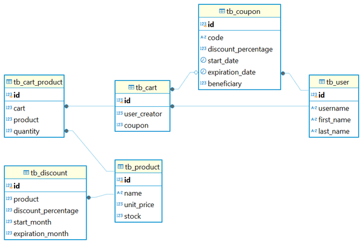

# API de Carrito de Compras

## Tabla de Contenidos
- [Introducción](#introducción)
- [Prerrequisitos](#prerrequisitos)
- [Configuración de la Base de Datos](#configuración-de-la-base-de-datos)
- [Modelo Entidad-Relación](#modelo-entidad-relación)
- [Cómo Ejecutar el Proyecto](#cómo-ejecutar-el-proyecto)
- [Documentación de Swagger](#documentación-de-swagger)

## Introducción
La API de Carrito de Compras es una aplicación basada en Spring Boot que permite a los usuarios gestionar un carrito de compras. Proporciona endpoints para añadir, eliminar y gestionar artículos en un carrito, y admite la integración con una base de datos para persistir datos. Este proyecto utiliza Gradle para la gestión de dependencias y construcción.

## Prerrequisitos
Asegúrese de tener instalado y configurado lo siguiente:

1. **Java Development Kit (JDK):** Versión 17.
2. **Gradle:** Versión 8.11.1.
3. **Base de Datos:** PostgreSQL 15.
4. **IDE (opcional):** IntelliJ IDEA, Eclipse o Visual Studio Code.

## Configuración de la Base de Datos

Antes de ejecutar el proyecto, asegúrese de tener creada una base de datos con el nombre `ecommerce` y que contenga el schema `public`. Luego, configure la base de datos de la siguiente manera:

1. Navegue a la carpeta `docs` en la raíz del proyecto.
2. Ejecute el archivo `1.DDL.sql` para crear el esquema de la base de datos.
3. Ejecute el archivo `2.DML.sql` para poblar la base de datos con datos iniciales.

```bash
./docs/1.DDL.sql
./docs/2.DML.sql
```

## Modelo Entidad-Relación

A continuación se presenta el diagrama modelo entidad-relación (ER) de la API de Carrito de Compras. Este modelo proporciona una visión general de la estructura de la base de datos utilizada en el proyecto.



***Nota:** el diagrama lo puedes encontrar en la siguiente ubicación:* 

```bash
./docs/3.ER_Model.png
```

## Cómo Ejecutar el Proyecto

1. Clone el repositorio:
   ```bash
   git clone <url_repositorio>
   cd <directorio_proyecto>
   ```

2. Compile el proyecto usando Gradle:
   ```bash
   gradlew build
   ```

3. Reemplace los valores de los argumentos con los valores correspondientes a la configuración de su base de datos antes de ejecutar el comando:
   ```bash
   gradlew bootRun -Dspring.datasource.url=jdbc:postgresql://localhost:5432/ecommerce -Dspring.datasource.username=admin -Dspring.datasource.password=admin
   ```
4. Tambien puedes modificar los datos de conexión a la base de datos directamente en el archivo `application.yml`. Luego ejecute el comando:
   ```bash
   gradlew bootRun
   ```

5. La aplicación se iniciará en el puerto 8080 (`http://localhost:8080`).

## Documentación de Swagger

La documentación de la API está disponible a través de Swagger. Una vez que la aplicación esté en ejecución, accédala en la siguiente URL:

```
http://localhost:8080/swagger-ui/index.html
```
